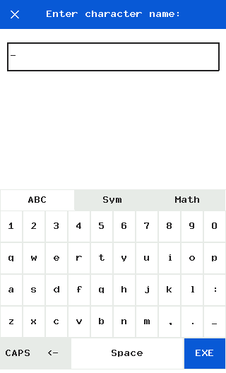
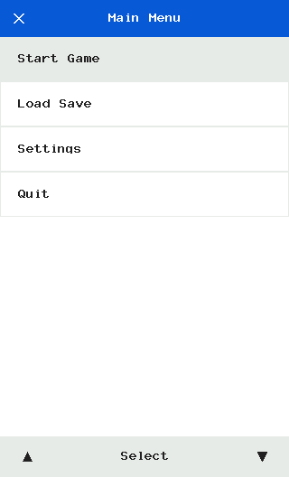
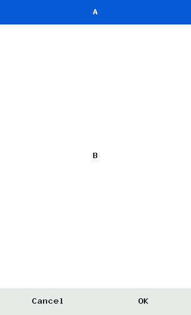
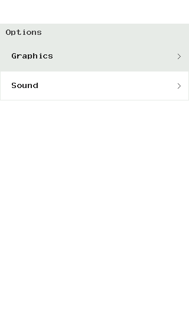

Yo! Ready to build something sick? This tutorial walks you through everything from asking the user for text, dropping slick selection menus, getting confirmations, and building advanced lists.

Let's hit the ground running.

## 1. Popping Text Inputs 💥

Stop manually drawing on-screen keyboards! Whether you need text, integers, or floating point numbers, `cinput.input()` handles everything—complete with touch-support and smooth themes.

```python
import cinput
from gint import *

# Just one line to summon the magical keyboard!
name = cinput.input("Enter character name:", type="text", theme="dark")

if name:
    print(f"What's up, {name}!")
```



Need numbers? No sweat. Change `type="text"` to `type="numeric_int"` or `type="numeric_float"`. The keyboard instantly transforms into a clean numpad!

---

## 2. Choosing From Lists 📜

Got multiple options for the user? Use `cinput.pick()`. It pops up a gorgeous, swipeable list box. You can even enable multi-select with checkmarks. 

```python
options = ["Start Game", "Load Save", "Settings", "Quit"]

# This halts execution until the user picks something.
choice = cinput.pick(options, "Main Menu", theme="light")

if choice == "Start Game":
    start_level()
```



**Pro-Tip:** Turn on `multi=True` in the arguments, and your homies can tap multiple items before hitting OK. 

---

## 3. The "Are You Sure?" Dialog 🚨

You don't want someone accidentally deleting their 100-hour Pokemon save. Throw an elegant confirmation overlay right in their face using `cinput.ask()`.

```python
sure = cinput.ask("Delete Save?", "This action cannot be undone.", ok_text="DELETE", theme="light")

if sure:
    delete_everything()
```



---

## 4. Advanced Component: List View 🗂️

Want to build an app with lots of data, custom icons, or section headers? The `ListView` widget is the beast powering the `pick()` function, but you can embed it inside your *own* windows!

```python
import cinput
from gint import *

items = [
    {'type': 'section', 'text': 'Options', 'height': 30},
    {'type': 'item', 'text': 'Graphics', 'height': 50, 'arrow': True},
    {'type': 'item', 'text': 'Sound', 'height': 50, 'arrow': True}
]

# Set coordinates: (X, Y, W, H)
my_list = cinput.ListView((0, 40, 320, 528-40), items)

while True:
    dclear(C_WHITE)
    my_list.draw()
    dupdate()
    
    # Let ListView handle touch/scrolls!
    events = pollevent_all()
    action = my_list.update(events)
    
    if action:
        # action is ('click', index, item)
        print("User tapped:", action[2]['text'])
```



---

## 5. Taking It Further (Activities) 🚀

Once you master the basic widgets, you can start building **Activities!** An Activity is just a Python class that draws its own custom layout, handles its own event loop, and summons `cinput.input` when needed. 

Check out the `physchem_mod.py` demo in the project! It creates a `SolverActivity` filled with interactive fields. It runs a loop, and when someone clicks a math variable, it internally calls `cinput.input(..., type="numeric_float")`, recalculates the answer, and redraws! 

You're a pro now! Check out the [Reference Manual](/reference) to totally mod out the color themes and parameters! 
